# Blog Writeup ([Tryhackme](https://tryhackme.com/room/blog)) - by [yag1n3](https://www.github.com/yaguine)

---

## Room Info

### Room Labels
* CVE-2019-8943
* Wordpress
* Blog
* Web

### Room Objetives
* Root.txt
* User.txt
* Where was user.txt found?
* What CMS was Billy using?
* What version of the above CMS was being used?

---

## Reconnaissance

### Nmap 

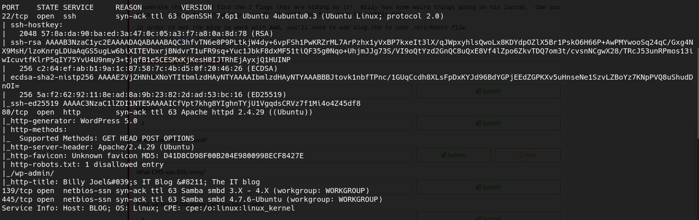

A Wordpress site and some Samba  

### Samba

We use **enum4linux** to retrieve some information  

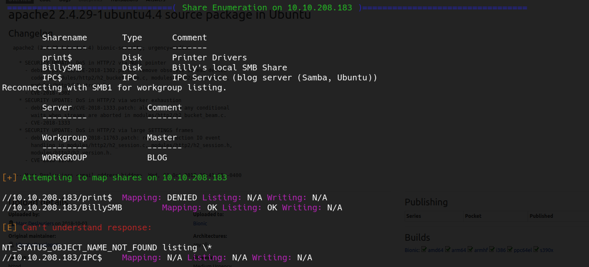  
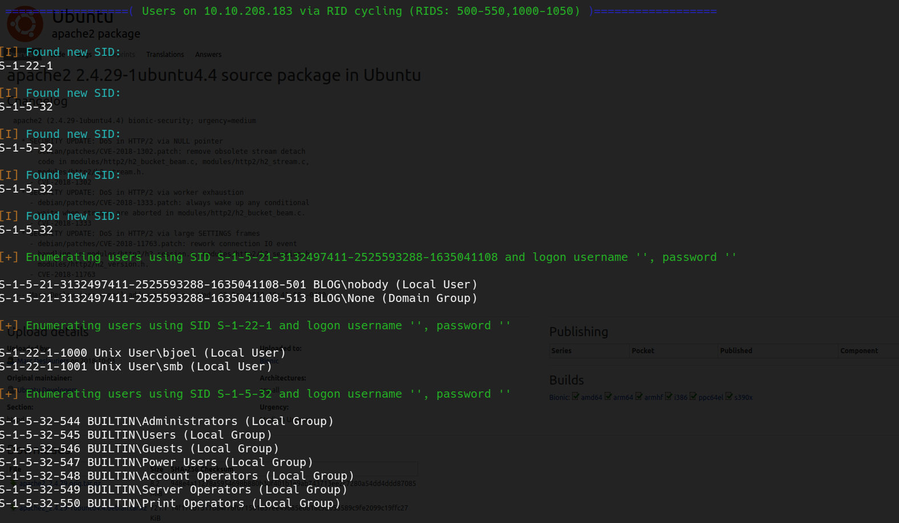  

We are able to access the share *BillySMB* without providing password  
there are some *.png* and a *.mp4*, it might be a steganography thing or maybe it's just trolling  
i'm gonna assume that it's trolling, i will come back later if there's no other choice  

### Website

it is a Wordpress Site  

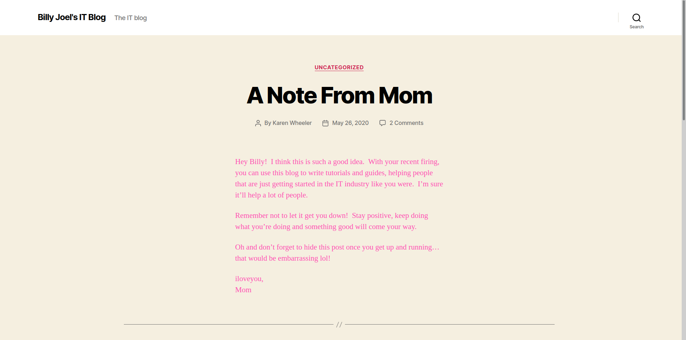  

looking at the blog's posts and comments, i am able to find 2 usernames: *kwheel* and *bjoel*  
i confirm that this users exist on the **wp-admin** page  
note : you have to add *blog.thm* to your **/etc/hosts** file  

we use **wpscan** to run some basic enumeration on the website  
most important information we retrieve:
* Wordpress version: 5.0
* Wordpress theme: twentytwenty

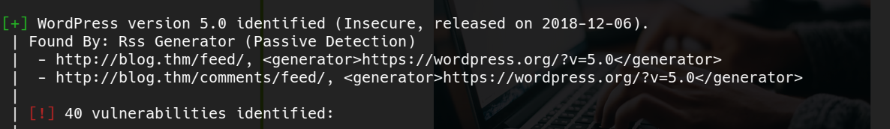  
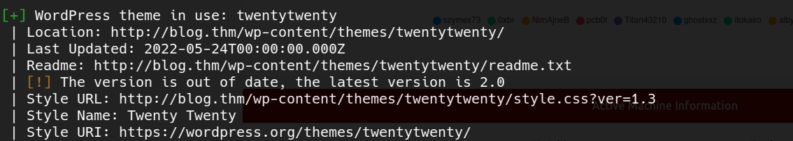  

first of all : we can answer two of the room questions 
* What CMS was Billy using?   **Wordpress**
* What version of the above CMS was being used?   **5.0**

we also discover that this Wordpress version is vulnerable to Authenticated RCE  
we have [this exploit](https://www.exploit-db.com/exploits/49512)  
we have two usernames, so now we need a password  

using the command `steghide extract -sf ` on the file *Alice-White-Rabbit.jpg* from the Samba share, we get a text file  

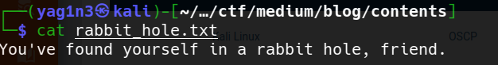  

ok, definetely we were being trolled  

since we have 2 usernames, we can try bruteforce on the wordpress site with **wpscan**  
we use the following command  
`wpscan --url http://blog.thm -e u -t 50 -U bjoel,kwheel -P /usr/share/wordlists/rockyou.txt`  
we specify the program tu enumerate just users to avoid the default enumeration and save time  
we have a password !!!  

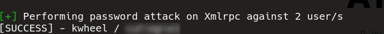  

now we can use the exploit  
i'm gonna be honest, i was not able to make the exploit work, but there is a metasploit one  
the module is *exploit/multi/http/wp_crop_rce*  

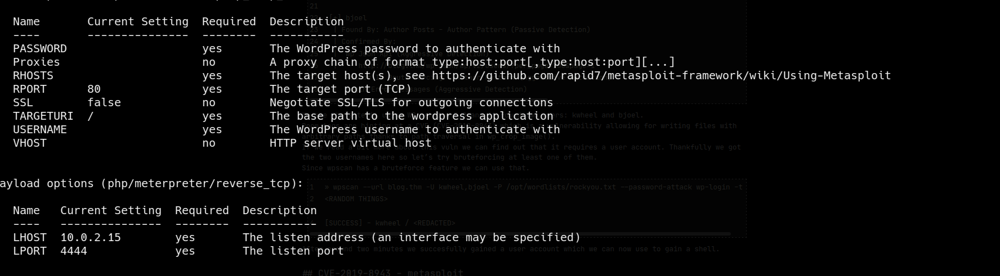  

pretty basic options, like hosts IP's, ports, username and password  
now we have a shell as **www-data** !!!

---

## Root Shell

as always, there is a *wp-config.php* on the web's directory  
we discover some credentials that you can use on mysql  
first i try the password on the machine's users (*bjoel* and *root*), but it doesnt work  

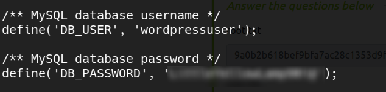  

the only interesting thing on the mysql bbdd is that we have the hash of the wordpress user *bjoel*  
but i discover afterwards that the password for *bjoel* on wordpress is the same as the password for *wordpressuser* on mysql  
there's also a wordpress post on the ddbb that i had not seen on the website, but it doesn't contain additional information  

there is a file called *Billy_Joel_Termination_May20-2020.pdf* on *bjoel's* home directory  
seems also like a rabbit hole  

we try some basic enumeration, like searching for binaries with the SUID bit set  

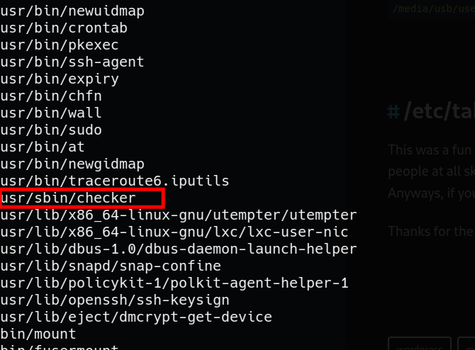  

this is an interesting one !!  

### Abusing the SUID binary

i have to make a confesion : i wasn't able to advance past this point. i realized that *checker* was a weird binary, but since i found nothing on google i just ignored it. but that's a mistake. the fact that there's nothing on Google about the binary means that it is handmade for this CTF  

so, i give up and i look at another person's Writeup  

when you run the binary, you get the following message :  
"Not an Admin"  

you can use **strings** to see if there's anything interesting, but **ltrace** is way better to try to know what's going on  
also i saw another writeup uses **Ghydra**, but **ltrace** is faster in this situation  
this is the output :

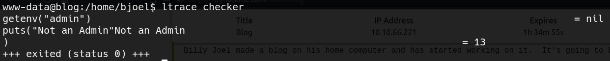  

so, it looks like it's taking an environment variable called "admin"  
so let's set it to true with the command `export admin=true`  

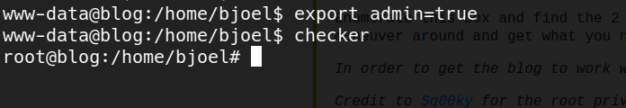  

Success !!!

### User.txt

the "user.txt" file on *bjoel's* home directory is empty  
we find all files owned by *bjoel* with the command `find / -user bjoel`  
*/media/usb/user.txt* is what we are looking for  

---

## Conclusions

This was a great machine for me to learn about the *ltrace* command, and also that if you see a weird binary of which there is no information on the Internet,that probably means that is specifically made by the machine creator to abuse. I think the machine uses some unusual techniques, like Wordpress enumeration, direct escalation from www-data to root, and so. I would totally recommend this machine, props to the creator.

